<b>
NAMA: OTAVIA ULANDARI  
NIM: 244107020053  
KELAS: TI2F
</b>

## JOBSHEET 04

---

## Praktikum 01

### Sebelum diubah
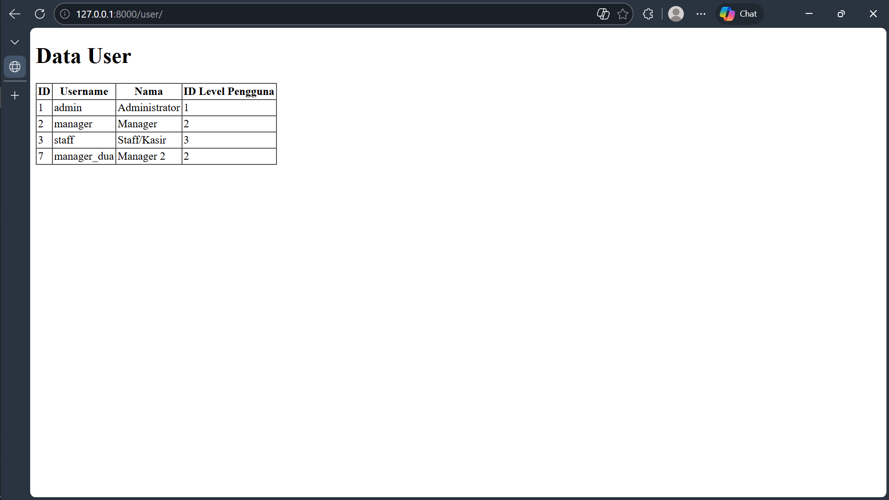

### Setelah menghapus array password
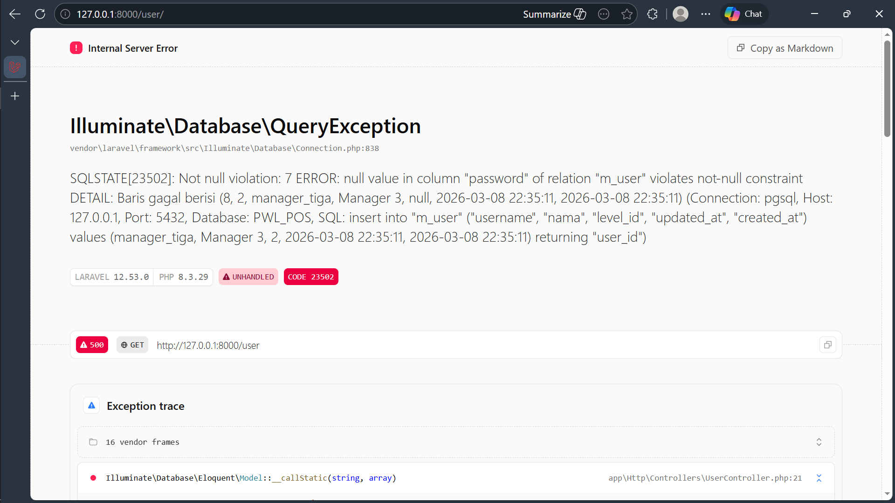

---

## Praktikum 02.1

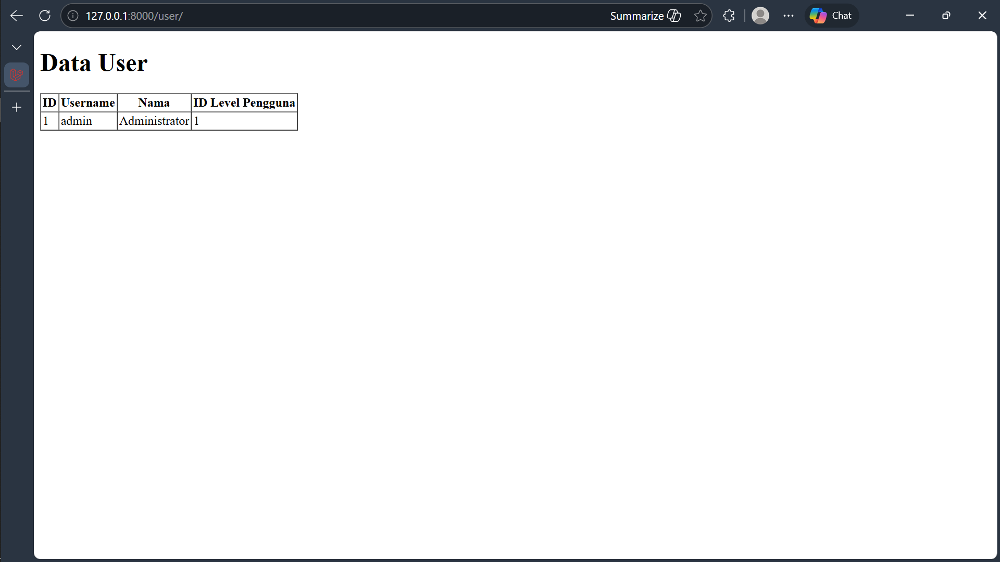

Ketiga kode pada jobsheet praktikum 2.1.1 sama-sama bertujuan melakukan query pada model di Laravel.

- `UserModel::firstWhere('level_id', 1)` benar dan langsung mengambil data pertama dengan `level_id = 1`.
- `UserModel::where('level_id', 1)->firstWhere()` salah karena `firstWhere()` harus memiliki parameter.
- `UserModel::where(1)` juga salah karena `where()` harus berisi nama kolom dan nilai.

---

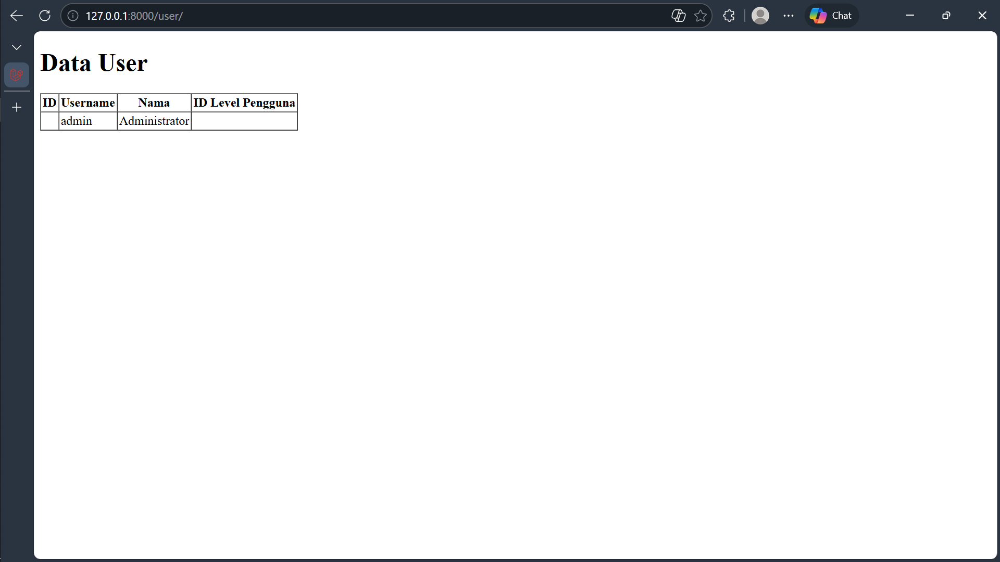

Kode pada langkah ke-2 menghasilkan view di atas dengan memanggil metode `findOr` pada model Laravel untuk mencari data User dengan **ID = 1**, tetapi hanya mengambil kolom `username` dan `nama`.

Jika data dengan ID tersebut tidak ditemukan, maka fungsi callback akan dijalankan yang memanggil `abort(404)` sehingga aplikasi mengembalikan **HTTP 404 (Not Found)**.

Seperti hasil pada langkah ke-10 berikut:

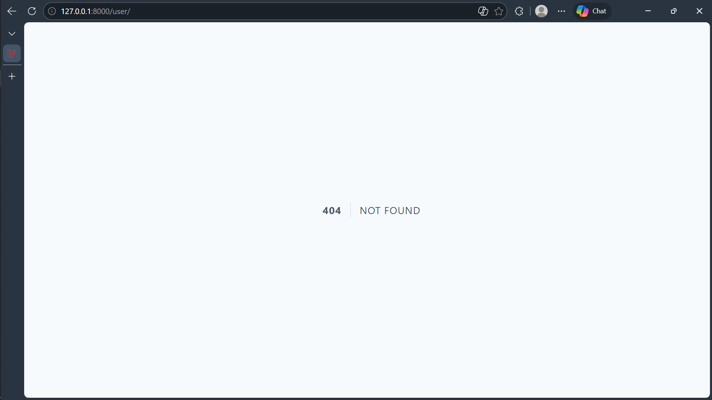

---

## Praktikum 02.2

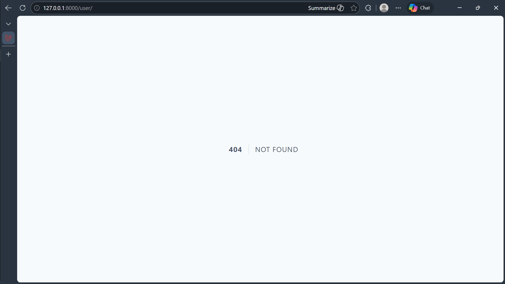

Kesimpulan pada praktikum 2.2:

- `findOrFail(1)` mencari data User berdasarkan **primary key (ID = 1)** dan akan otomatis melempar exception jika data tidak ditemukan.
- `firstOrFail()` digunakan setelah query `where`, sehingga mengambil record pertama yang cocok dengan kondisi `username = 'manager9'`.

Jika tidak ada data yang cocok, keduanya akan melempar **ModelNotFoundException** yang biasanya otomatis menjadi **HTTP 404 di Laravel** seperti pada gambar kedua.

---

## Praktikum 02.3

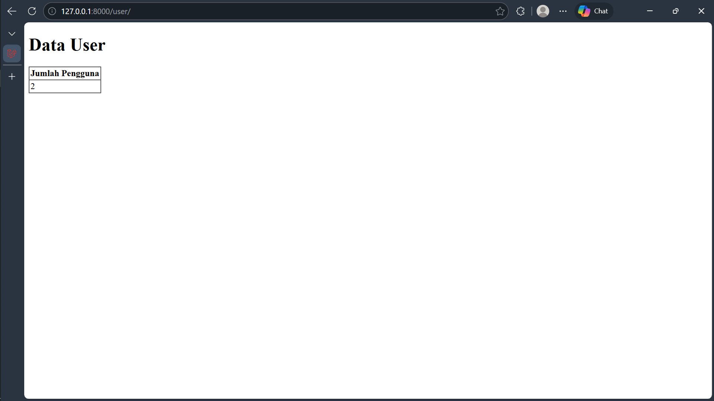

---

## Praktikum 02.4

Terdapat perbedaan hasil antara langkah 6 dan langkah 8 pada data yang digunakan untuk pencarian sekaligus insert oleh `firstOrCreate()` di Laravel.

- **Langkah 6** hanya mencari atau membuat user berdasarkan `username` dan `nama`.
- **Langkah 8** menggunakan `username`, `nama`, `password`, dan `level_id` sebagai kondisi pencarian.

Akibatnya pada kode kedua, jika `password` atau `level_id` berbeda, Laravel akan menganggap data belum ada dan dapat membuat record baru lagi.

### Hasil view langkah 6
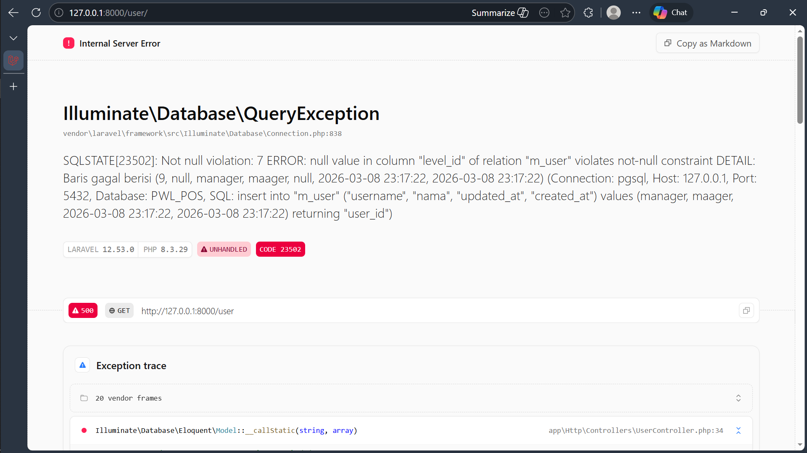

### Hasil view langkah 8
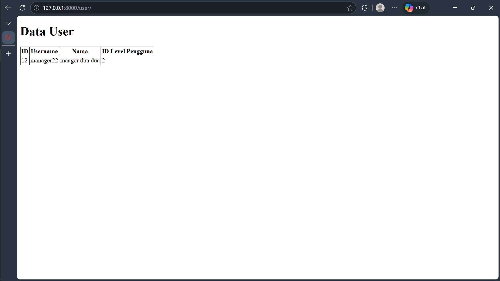

---

## Praktikum 02.5

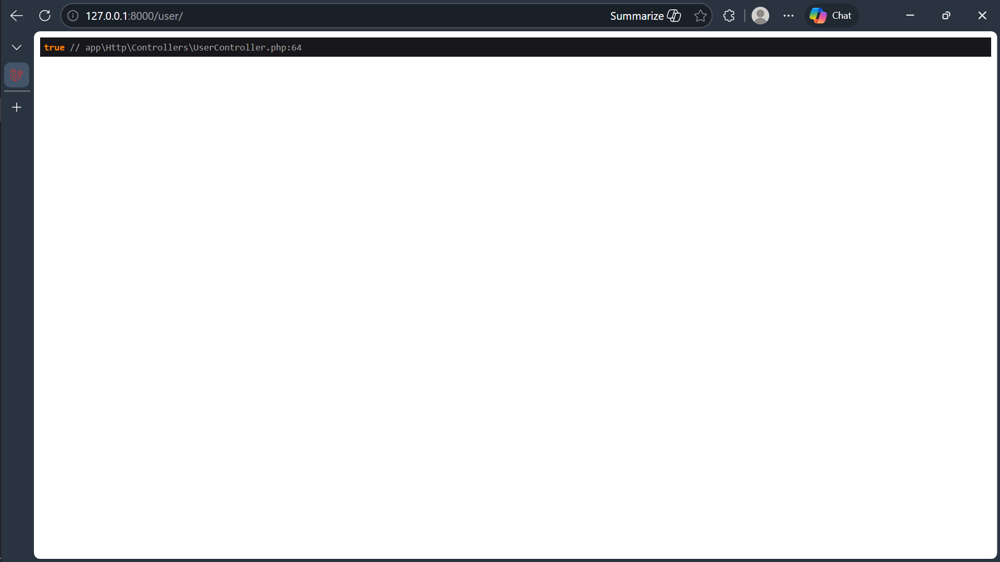

- `isDirty()` digunakan untuk mengecek apakah ada atribut pada model yang berubah tetapi **belum disimpan** ke database.
- `wasChanged()` digunakan untuk mengecek apakah atribut **benar-benar berubah setelah proses `save()` dilakukan**.

Kesimpulannya:
- `isDirty()` digunakan **sebelum penyimpanan data**.
- `wasChanged()` digunakan **setelah data berhasil disimpan ke database**.

---

## Praktikum 02.6

### Read
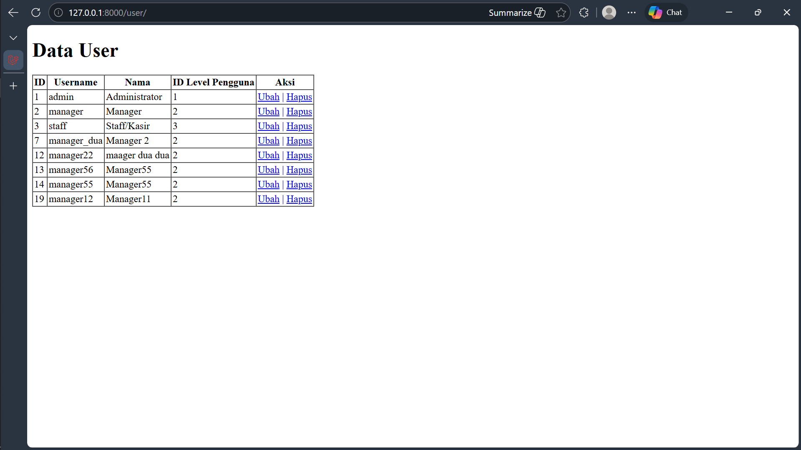

### Create
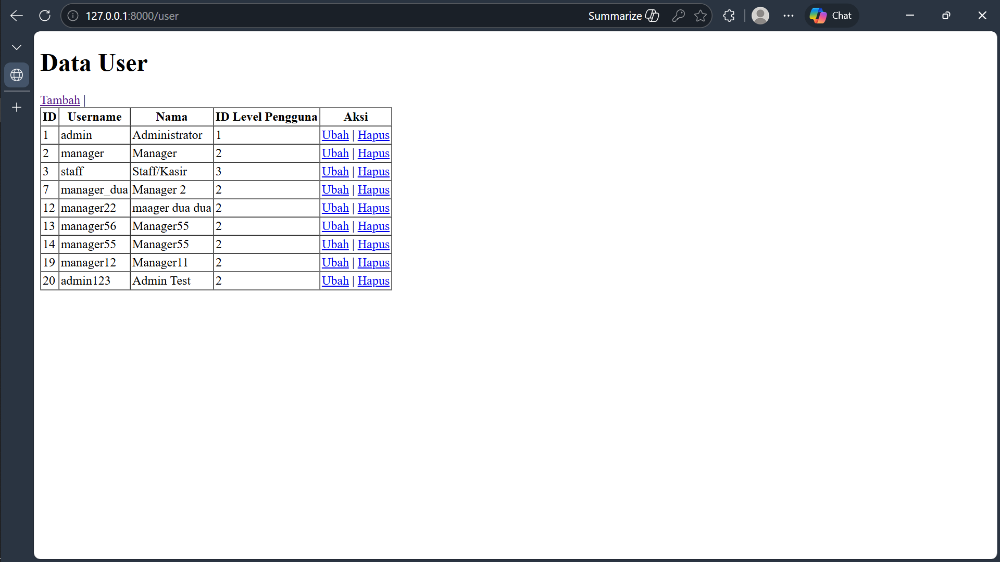

### Update
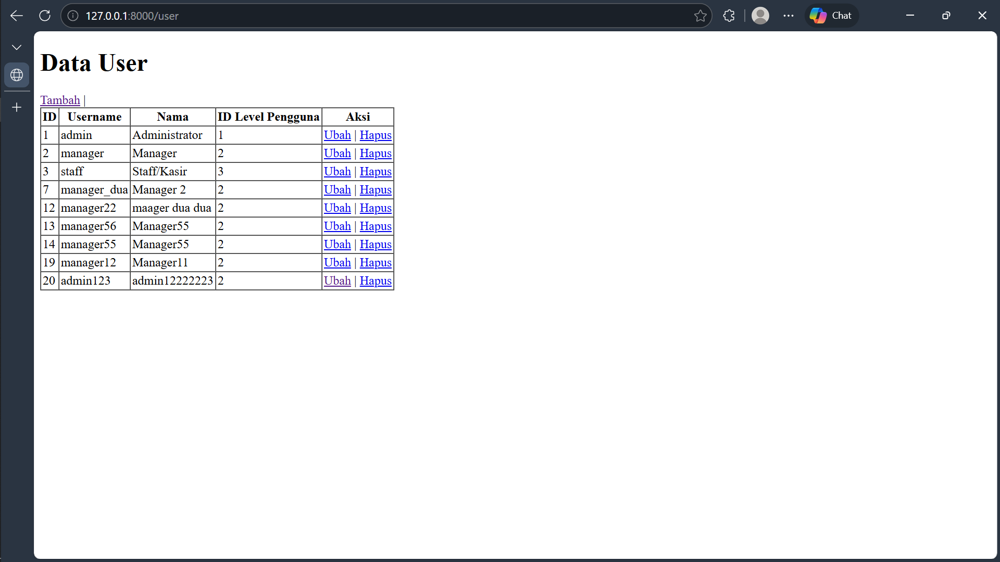

### Delete
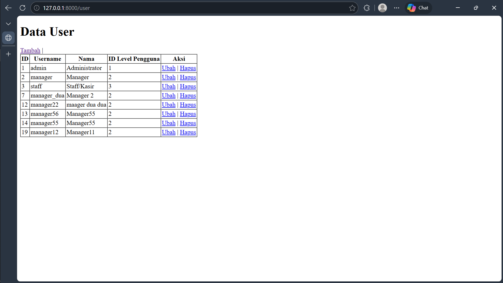

---

## Praktikum 02.7

Praktikum 2.7 memberikan kesimpulan bahwa **model merupakan cara untuk menghubungkan tabel-tabel yang saling berkaitan di database**.

Dengan relationship, data dari tabel lain dapat diambil tanpa harus menulis query SQL secara manual karena Laravel menyediakan fungsi relasi seperti:

- `belongsTo`
- `hasOne`
- `hasMany`

Pada praktikum ini, digunakan relasi **belongsTo**, dimana **satu data User memiliki satu Level** yang disimpan pada tabel berbeda.

Kesimpulannya, **relationship dalam Eloquent memudahkan pengelolaan dan pengambilan data antar tabel sehingga kode program menjadi lebih sederhana, terstruktur, dan mudah dipahami**.

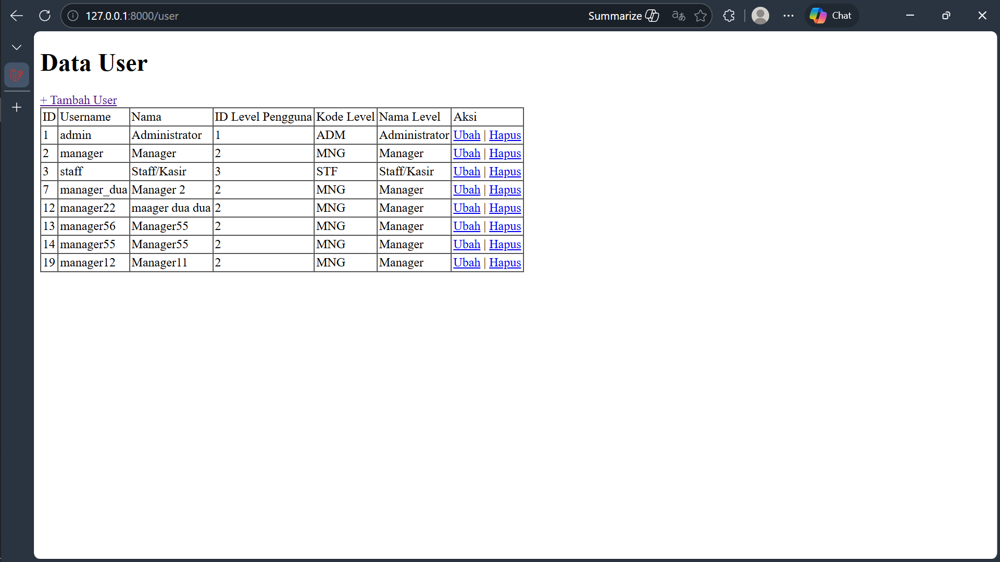