<b>NAMA: OTAVIA ULANDARI  
NIM: 244107020053  
KELAS: TI2F</b>

PRAKTIKUM 1: 
Hasil dari praktikum 01:
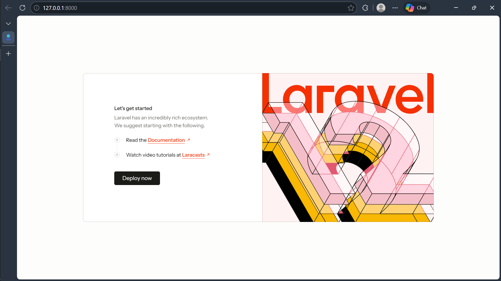

PRAKTIKUM 2: 
Hasil dari migrasi yang saya coba buat:
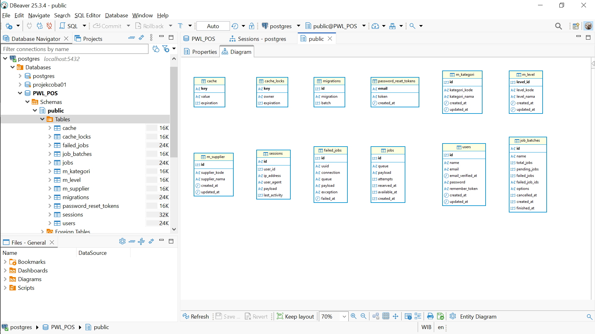

PRAKTIKUM 3: 
Hasil dari beberapa seeder yang telah saya buat:
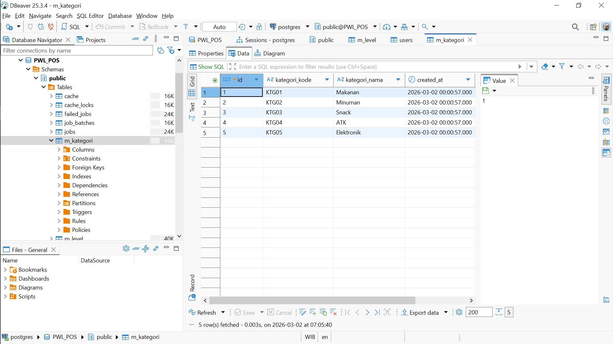
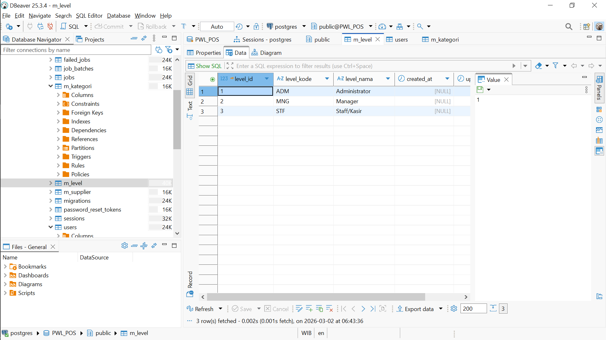
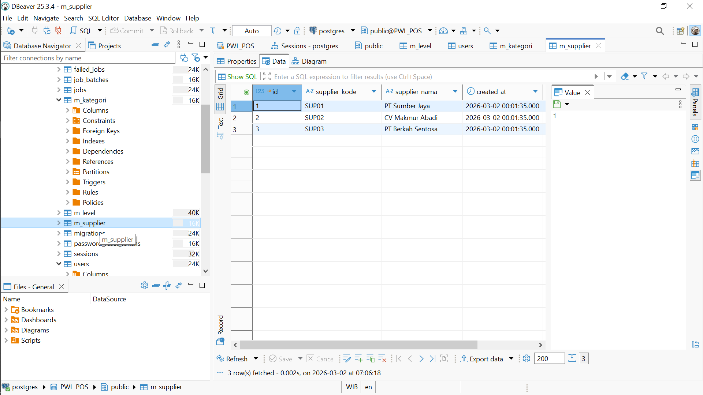

PRAKTIKUM 4:  
Hasil dari praktikum 4 mengenai CRUD yang telah saya buat:
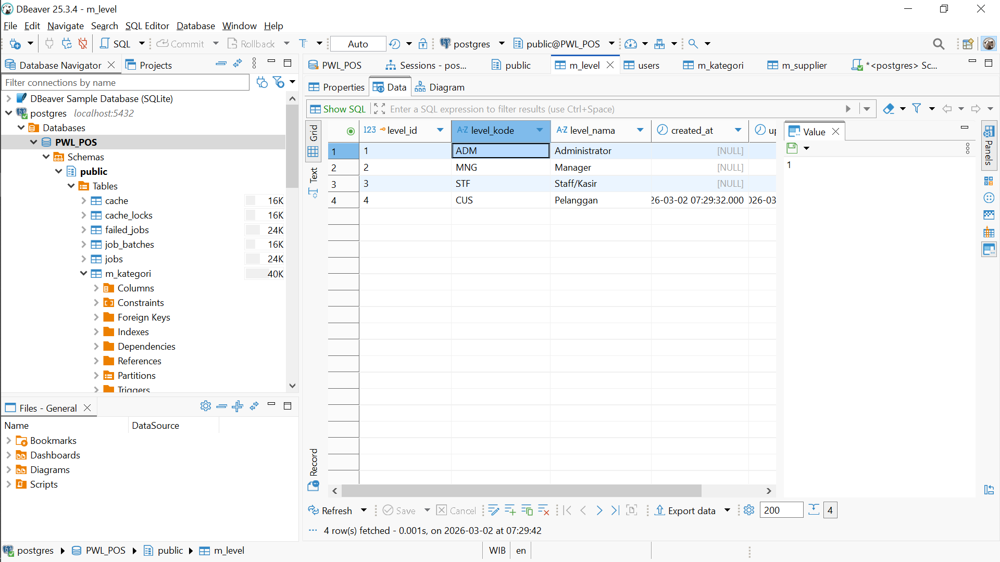
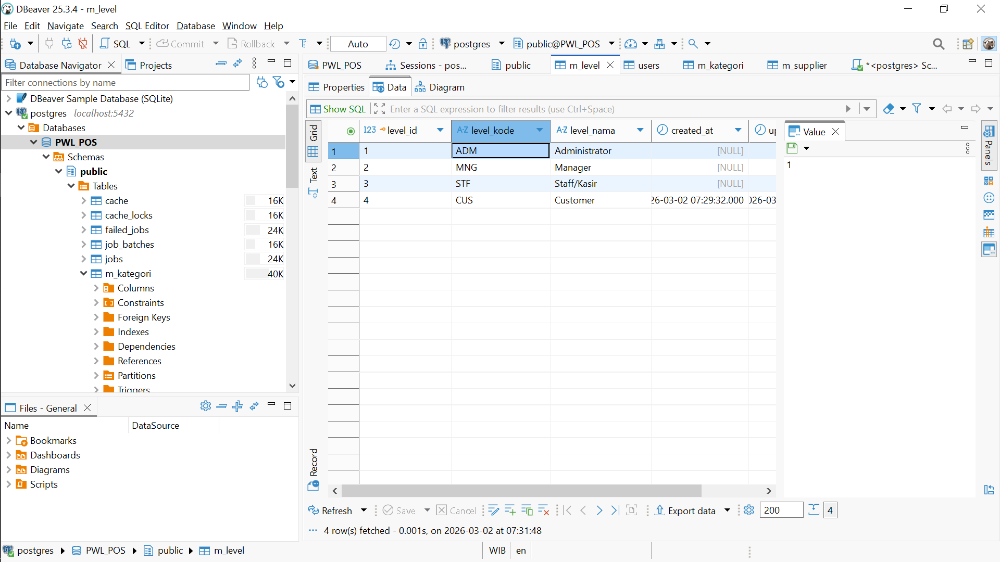
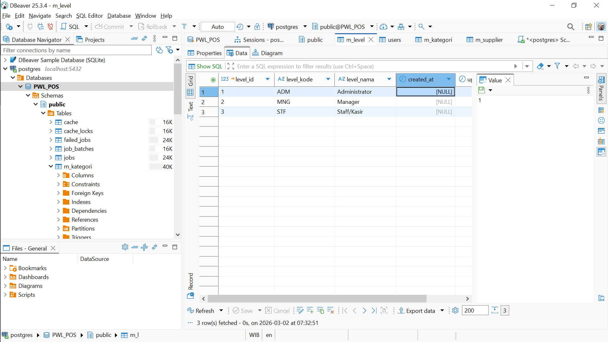
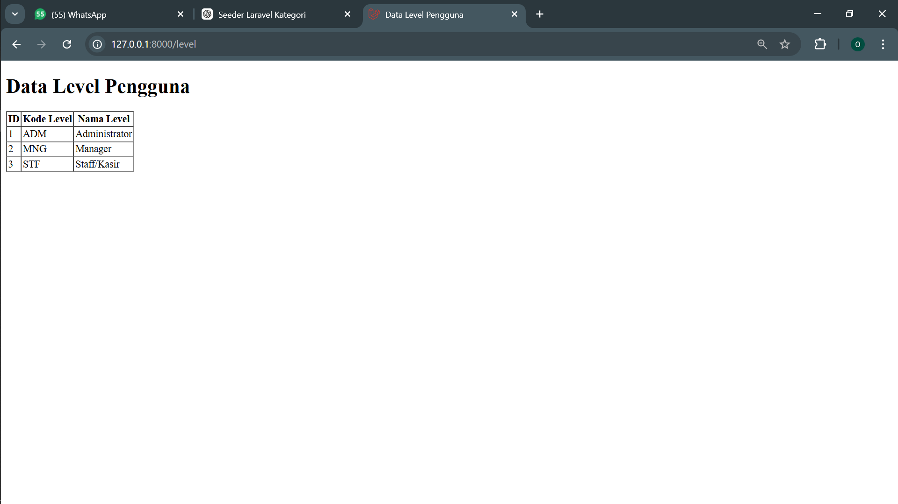

Hasil dari praktikum 5 mengenai CRUD yang telah saya buat:
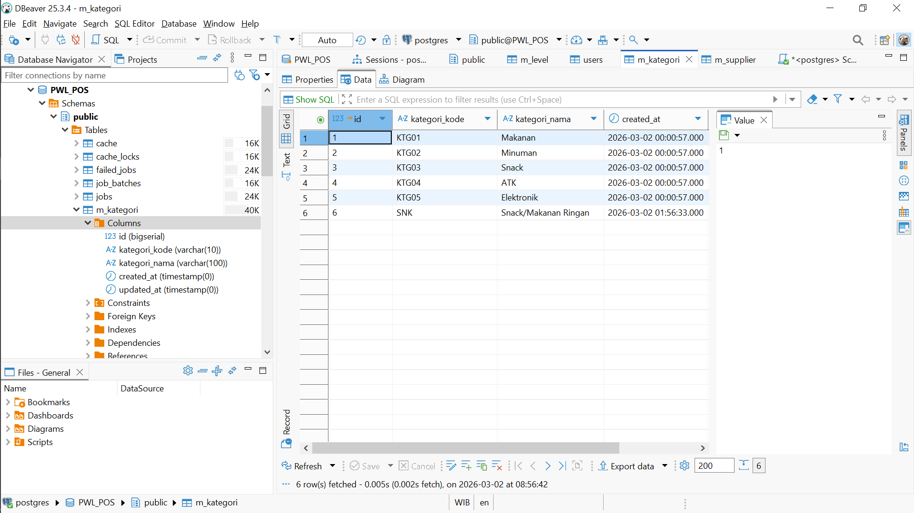
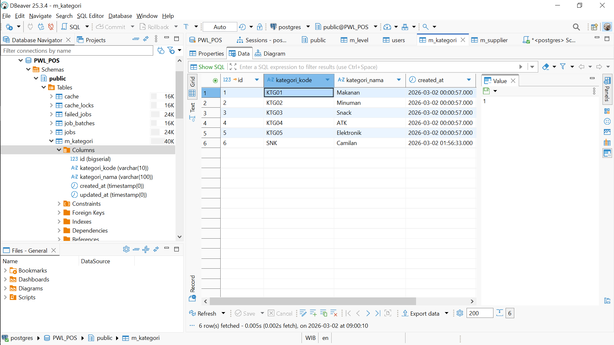
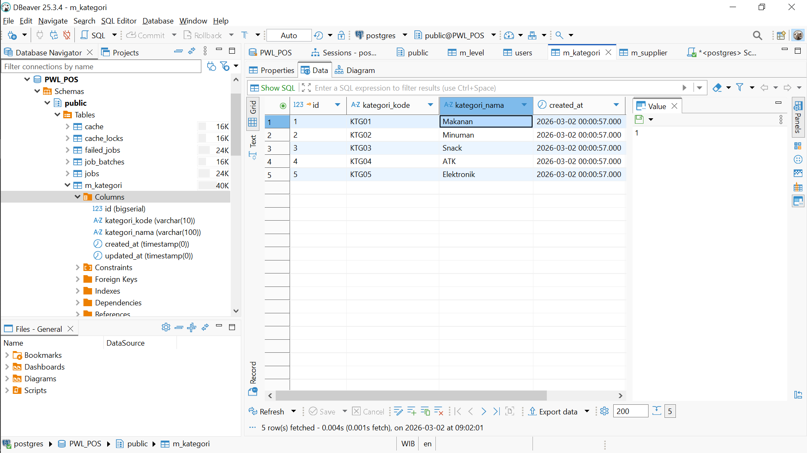
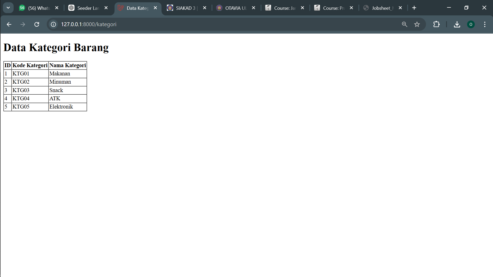

Hasil dari praktikum 6:
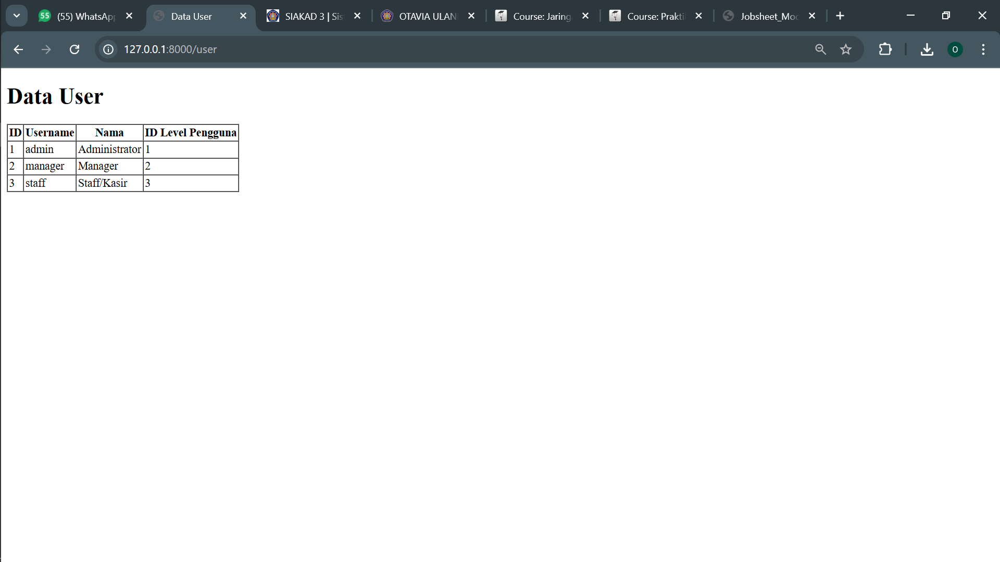