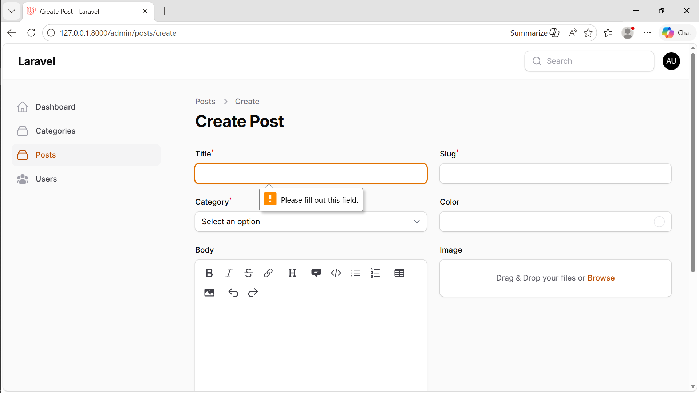

# Laporan Filament

**Nama:** Otavia Ulandari  
**NIM:** 244107020053  
**Kelas:** TI2F  

---

## Hasil Praktikum

### 1. Membuat Resource Post

### 2. Membuat Text Input

### 3. Select Relasi dengan Category

### 4. Field Color Picker

### 5. Markdown Editor

### 6. Alternatif Markdown

### 7. File Upload

### 8. Tags Input

### 9. Checkbox

### 10. Date Picker

### 11. View List Post

---

## Analisis & Diskusi

### 1. Mengapa perlu `storage:link`?
`storage:link` digunakan untuk menghubungkan folder penyimpanan (`storage/app/public`) ke folder publik (`public/storage`) agar file upload dapat diakses melalui browser.

### 2. Fungsi `$casts` untuk field JSON
`$casts` berfungsi mengubah data JSON di database menjadi array PHP secara otomatis, dan sebaliknya saat disimpan. Hal ini memudahkan pengolahan data tanpa perlu `json_encode` atau `json_decode`.

### 3. Mengapa menggunakan `category.name` bukan `category_id`?
Karena `category.name` lebih informatif dan mudah dipahami oleh pengguna, sedangkan `category_id` hanya berupa angka yang kurang bermakna.

### 4. Perbedaan RichEditor dan MarkdownEditor
RichEditor adalah editor visual (WYSIWYG) yang mudah digunakan tanpa syntax. Sedangkan MarkdownEditor menggunakan format teks khusus yang lebih ringan tetapi membutuhkan pemahaman Markdown.

---

## Validasi Required

---

## Analisis Layout Form

### 1. Mengapa layout form penting dalam aplikasi admin?
Layout form penting agar tampilan lebih rapi, mudah dibaca, dan efisien digunakan oleh admin. Dengan layout yang baik, proses input data menjadi lebih cepat dan minim kesalahan.

### 2. Apa perbedaan Section dan Group?
Section digunakan untuk membagi form menjadi bagian besar dengan judul dan deskripsi. Sedangkan Group hanya untuk mengelompokkan field tanpa header.

### 3. Kapan menggunakan `columnSpanFull()`?
Digunakan saat field perlu mengambil lebar penuh dalam grid. Biasanya untuk editor atau upload agar tampil lebih luas.

### 4. Apa keuntungan sistem grid 12 kolom?
Grid 12 kolom fleksibel dan mudah dibagi (misalnya 6-6 atau 4-4-4). Ini membantu membuat layout yang responsif dan konsisten.

---

## Analisis Validasi

### 1. Mengapa validasi penting pada admin panel?
Validasi memastikan data tetap akurat, konsisten, dan aman dari input tidak valid. Hal ini mencegah error dan menjaga kualitas data dalam sistem.

### 2. Perbedaan validasi client-side dan server-side
Client-side berjalan di browser untuk feedback cepat, sedangkan server-side berjalan di backend untuk keamanan. Keduanya saling melengkapi, namun server-side wajib digunakan.

### 3. Mengapa unique tetap bekerja saat edit?
Karena menggunakan `ignoreRecord: true`, sehingga data milik record yang diedit tidak dianggap duplikat. Ini memungkinkan update tanpa mengubah nilai unik.

### 4. Kapan menggunakan rules array dibanding string?
String cocok untuk validasi sederhana, sedangkan array digunakan untuk validasi kompleks. Array lebih fleksibel dan mudah dibaca untuk aturan yang dinamis.