# Laporan Filament

**Nama:** Otavia Ulandari  
**NIM:** 244107020053  
**Kelas:** TI2F  

---

## Hasil Membuat Resource Post
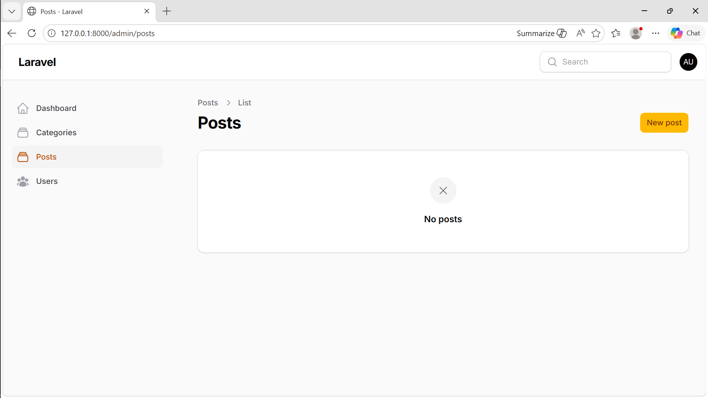

## Hasil Membuat Text Input
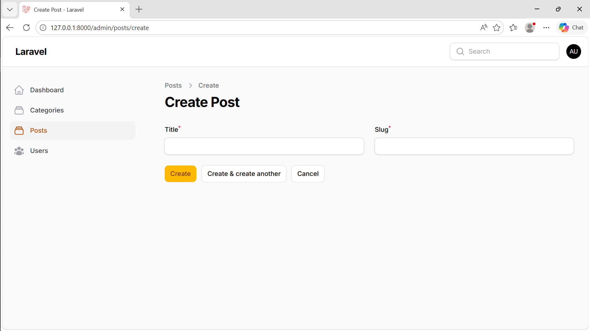

## Hasil Membuat Select yang Berelasi dengan Category
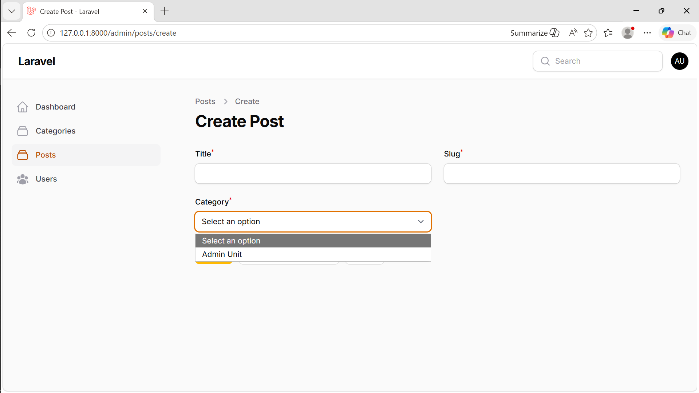

## Hasil Membuat Field Color Picker
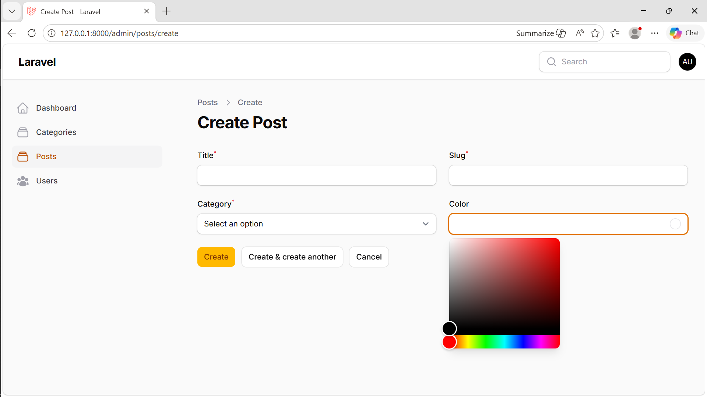

## Hasil Membuat Markdown
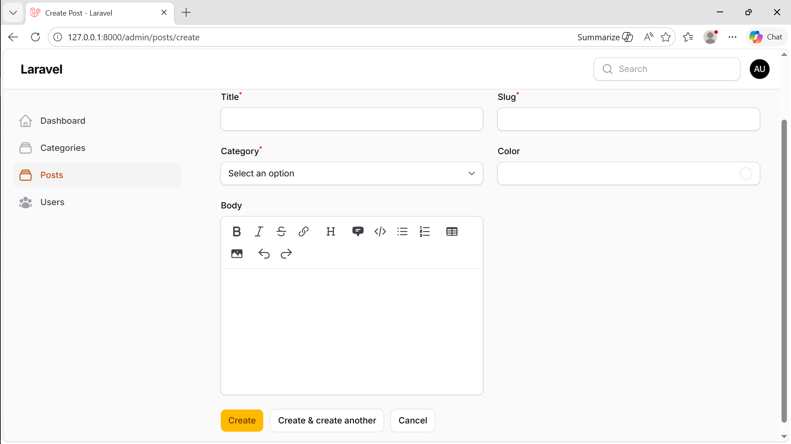

## Hasil Membuat Alternatif Markdown
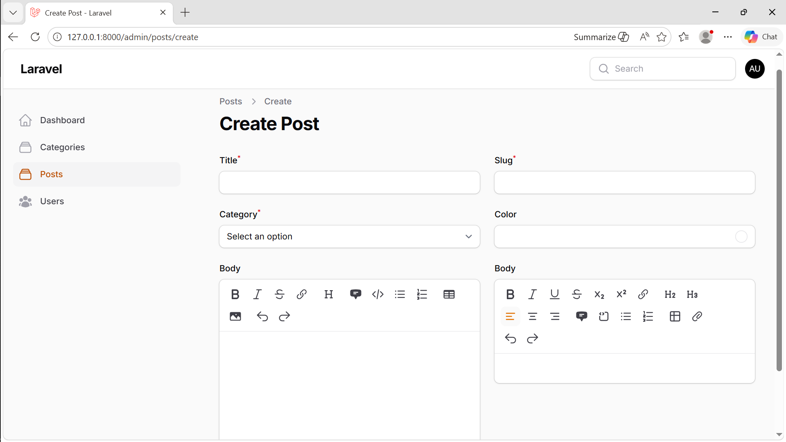

## Hasil Membuat File Upload
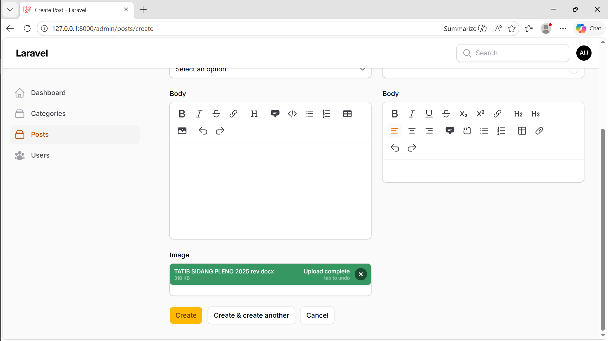

## Hasil Membuat Tags
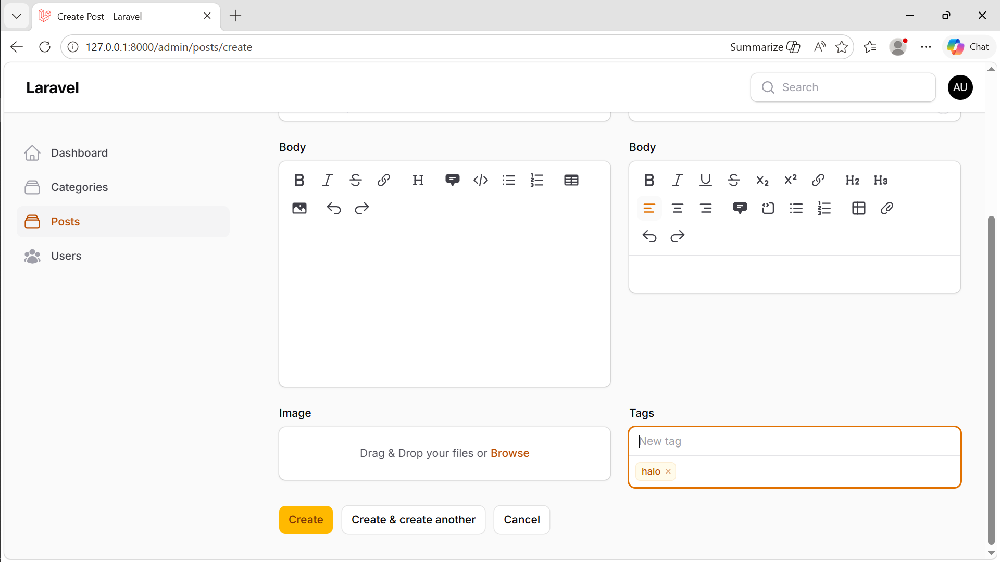

## Hasil Membuat Check Box
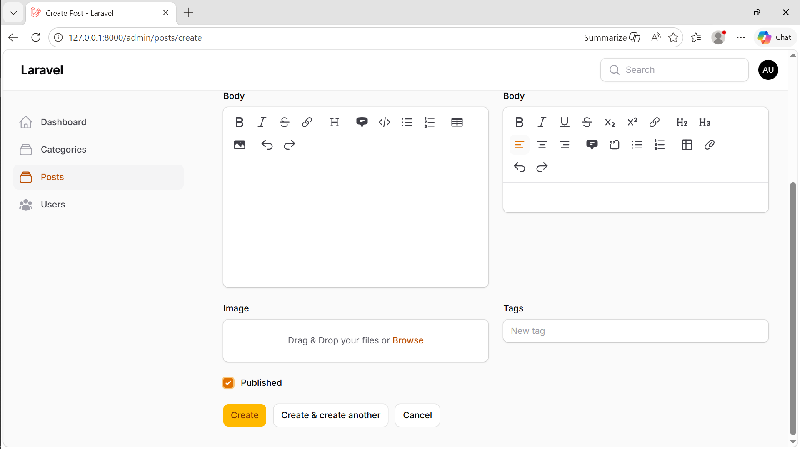

## Hasil Membuat Date Picker
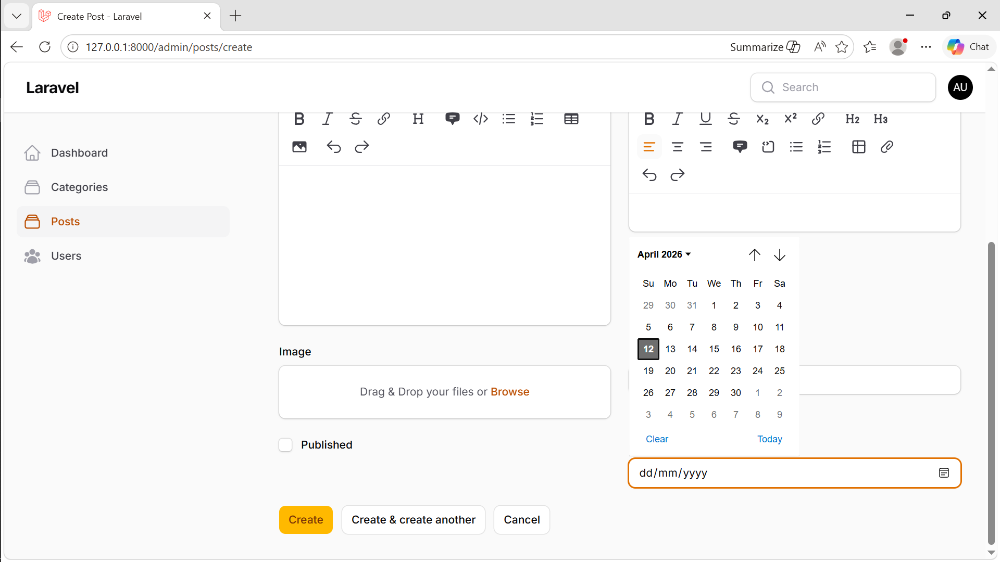

## Hasil View List Post
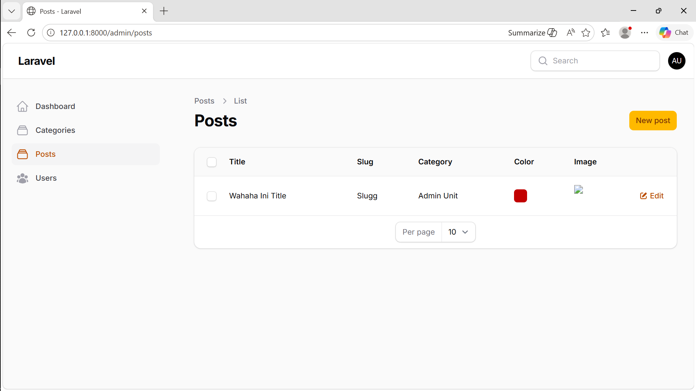

Analisis Diskusi
1. Mengapa perlu storage:link
storage:link digunakan untuk menghubungkan folder penyimpanan (storage/app/public) ke folder publik (public/storage) agar file upload (misalnya gambar dari Filament) bisa diakses melalui browser.

2. Fungsi $casts untuk field JSON
$casts berfungsi mengubah data JSON di database menjadi array PHP secara otomatis, dan sebaliknya saat disimpan. Ini memudahkan pengolahan data tanpa perlu json_encode atau json_decode.

3. Mengapa menggunakan category.name bukan category_id
Karena category.name menampilkan data yang lebih jelas dan mudah dipahami (misalnya nama kategori), sedangkan category_id hanya berupa angka ID yang kurang informatif.

4. Perbedaan RichEditor dan MarkdownEditor
RichEditor adalah editor visual (WYSIWYG) yang mudah digunakan tanpa perlu syntax, sedangkan MarkdownEditor menggunakan format teks khusus (Markdown) yang lebih ringan tetapi memerlukan pemahaman penulisan syntax.

