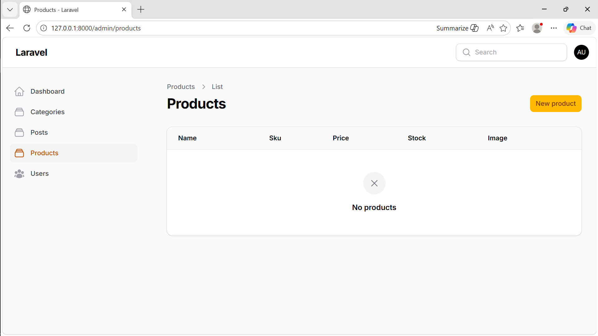
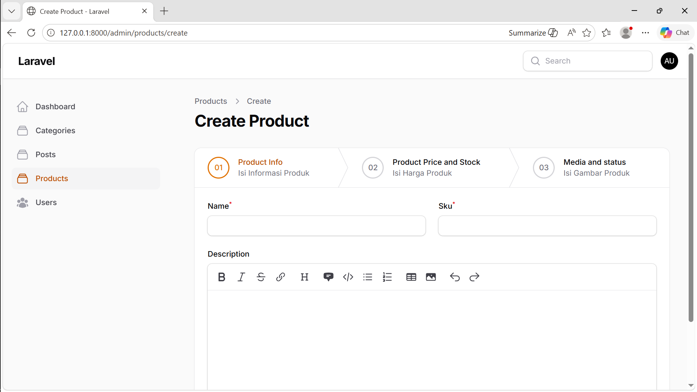
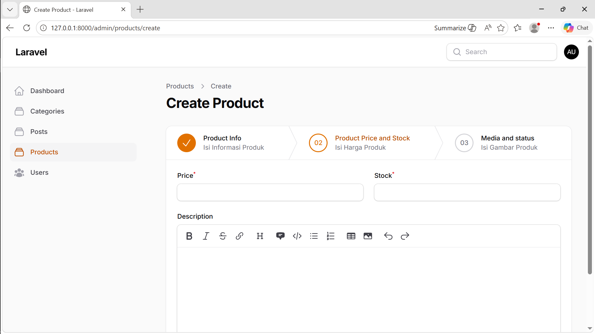
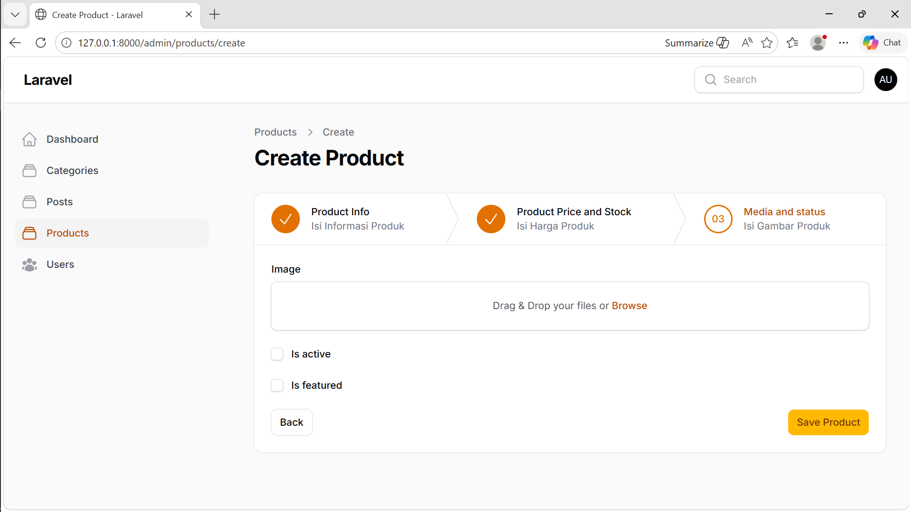
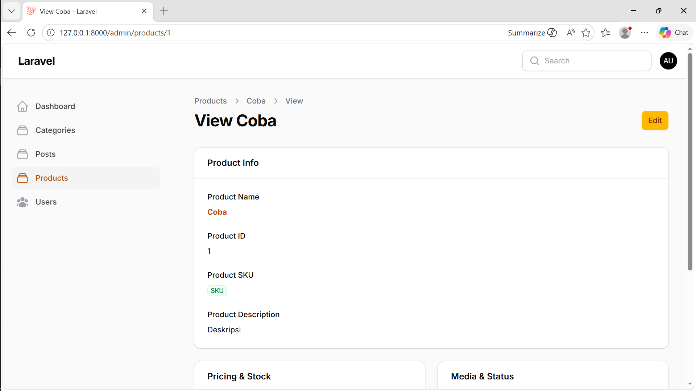
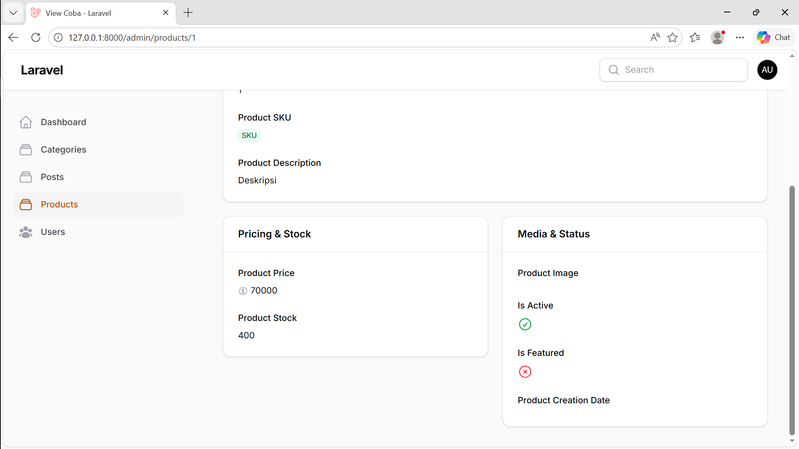
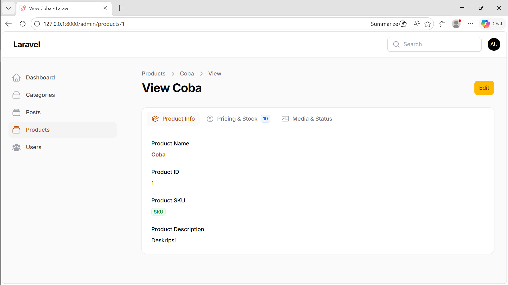
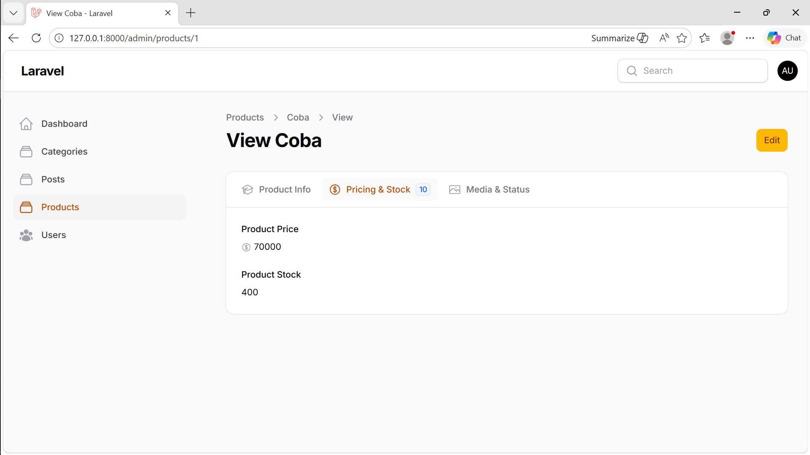
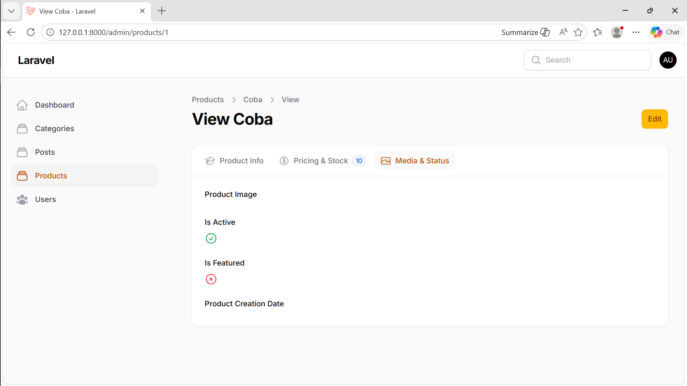

# Laporan Filament

**Nama:** Otavia Ulandari  
**NIM:** 244107020053  
**Kelas:** TI2F  

---

## Product Management

### 1. View List Product

### 2. Create Product

### 3. Tab Price & Stock (Create Product)

### 4. Tab Media & Status (Create Product)

---

### Pertanyaan & Jawaban

**1. Mengapa Wizard Form lebih baik untuk form panjang?**  
Wizard Form membagi form panjang menjadi beberapa langkah kecil sehingga lebih mudah dipahami dan tidak membebani pengguna. Hal ini membantu meningkatkan fokus dan mengurangi kesalahan input.

**2. Kapan kita menggunakan `skippable()`?**  
Digunakan ketika ada langkah dalam wizard yang bersifat opsional. Pengguna dapat melewati bagian yang tidak relevan tanpa mengganggu alur utama.

**3. Apa kelebihan multi step dibanding single form panjang?**  
Multi step membuat proses lebih terstruktur dan ringan karena dibagi per tahap. Selain itu, progres lebih jelas dan potensi kesalahan lebih kecil.

**4. Apakah wizard cocok untuk semua jenis form?**  
Tidak. Wizard cocok untuk form kompleks dan panjang. Untuk form sederhana, justru tidak efisien karena menambah langkah yang tidak perlu.

---

## Detail Product

### 1. View Detail Product

### 2. Detail Pricing & Stock + Media & Status

---

### Pertanyaan & Jawaban

**1. Mengapa View Page tidak cocok menggunakan form input?**  
Karena View Page bersifat read-only. Penggunaan form input bisa membingungkan karena terlihat seperti bisa diedit, serta kurang tepat secara UI.

**2. Apa perbedaan `TextColumn` dan `TextEntry`?**  
`TextColumn` digunakan pada Table untuk banyak data, sedangkan `TextEntry` digunakan pada Infolist untuk menampilkan detail satu data.

**3. Kapan kita menggunakan badge?**  
Saat ingin menonjolkan informasi seperti status atau kategori agar mudah dikenali secara visual.

**4. Apa keuntungan menggunakan `IconEntry` untuk boolean?**  
Lebih intuitif karena menggunakan ikon (✔/✖), sehingga lebih mudah dipahami dibanding teks `true/false`.

---

## Tabs pada Detail Product

### 1. Tab Product Info

### 2. Tab Pricing & Stock

### 3. Tab Media & Status

---

### Pertanyaan & Jawaban

**1. Kapan menggunakan Tabs dibanding Section?**  
Tabs digunakan saat data banyak dan bisa dikelompokkan. Section cocok untuk data yang sedikit dan perlu ditampilkan sekaligus.

**2. Apa kelebihan Tabs untuk data panjang?**  
Mengurangi scroll panjang dan membuat tampilan lebih rapi serta terorganisir.

**3. Apakah Tabs bisa digunakan pada Form?**  
Bisa. Filament menyediakan komponen Tabs untuk Form dan Infolist dengan penggunaan yang serupa.

**4. Bagaimana jika tab terlalu banyak?**  
Gunakan `vertical()` atau gabungkan tab yang berkaitan. Filament juga mendukung scroll horizontal sebagai fallback.