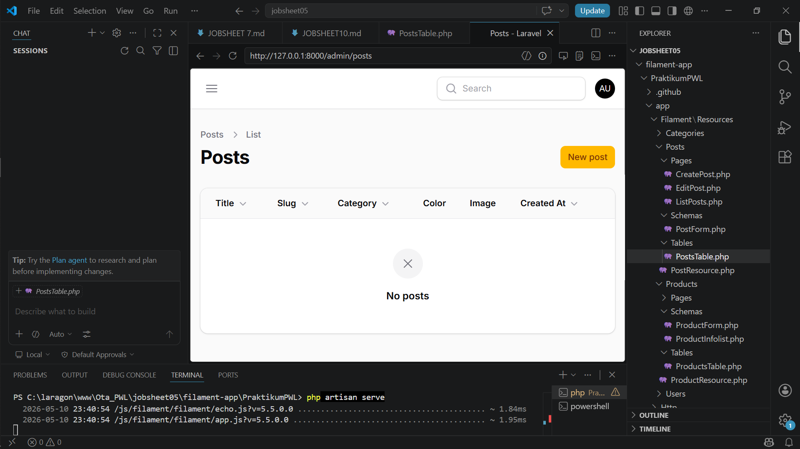

# Laporan Filament

**Nama:** Otavia Ulandari  
**NIM:** 244107020053  
**Kelas:** TI2F  

---

### 1. View List Product dengan short table

---

## Analisis & Diskusi

**1. Mengapa sorting penting pada admin panel?**
Dengan sorting, user/admin bisa dengan cepat menemukan data terbaru, data dengan nama tertentu, atau mengelompokkan data berdasarkan kategori. Shorting sangat meningkatkan efisiensi kerja, terutama saat data sudah mencapai ratusan hingga ribuan baris.

---

**2. Apa perbedaan `sortable()` dengan `defaultSort()`?**
`sortable()` dipasang pada level kolom — fungsinya hanya *mengizinkan* user untuk mengklik header kolom agar bisa diurutkan secara manual. Sedangkan `defaultSort()` dipasang pada level table dan berfungsi menentukan urutan awal saat halaman pertama kali dibuka, tanpa perlu interaksi dari user. Keduanya bisa dipakai bersamaan: `defaultSort()` menentukan urutan awal, dan `sortable()` memberi kebebasan user untuk mengubahnya.

---

**3. Mengapa relasi tetap bisa di-sort?**
Filament secara otomatis menangani join ke tabel relasi saat kolom relasi seperti `category.name` diberi `->sortable()`. Di balik layar, Filament menambahkan `JOIN` dan `ORDER BY` ke query Eloquent, sehingga pengurutan tetap dilakukan di level database — bukan di level PHP/collection. Hal ini membuat sorting relasi tetap efisien meskipun datanya banyak.

---

**4. Kapan kita menggunakan `desc` sebagai default?**

`desc` digunakan sebagai default ketika data terbaru atau terpenting secara logis harus ditampilkan paling atas. Contoh paling umum adalah kolom `created_at`. admin biasanya ingin langsung melihat postingan atau transaksi yang paling baru dibuat tanpa harus melakukan klik tambahan. Sebaliknya, `asc` lebih cocok untuk kolom seperti nama atau judul yang biasanya dibaca dari A ke Z.