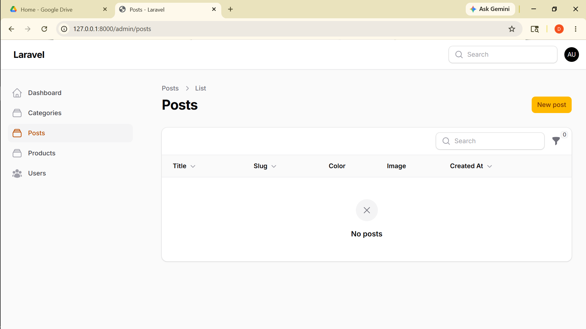
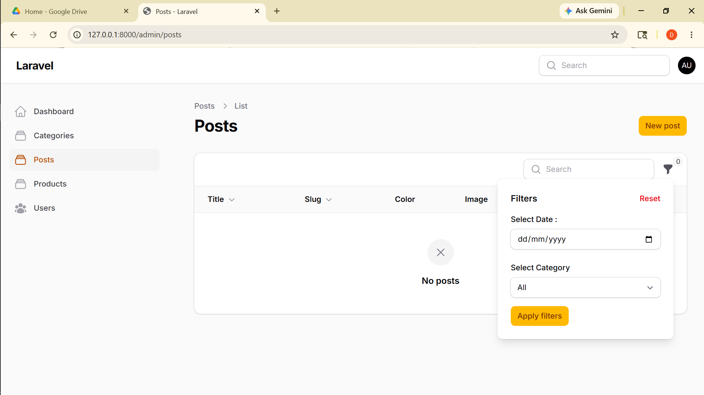

# Laporan Filament

**Nama:** Otavia Ulandari  
**NIM:** 244107020053  
**Kelas:** TI2F  

---

### 1. List View

---
### 2. Filter View

---
## Analisis & Diskusi

**1. Mengapa search tidak cocok untuk filter tanggal?**
Search bekerja secara real-time berdasarkan pencocokan teks (string), sedangkan tanggal memiliki format yang kompleks dan bervariasi sehingga sulit dicocokkan hanya dengan mengetik teks. Pengguna juga tidak selalu tahu format tanggal yang tersimpan di database (misalnya `2026-02-28 14:36:12`), sehingga pencarian manual akan sering gagal. Filter dengan DatePicker jauh lebih tepat karena pengguna cukup memilih tanggal dari kalender tanpa perlu mengetik format secara manual.

**2. Apa fungsi `relationship()` pada SelectFilter?**
Method `relationship()` digunakan untuk menghubungkan SelectFilter dengan tabel relasi, sehingga dropdown filter otomatis mengambil data dari model yang berelasi, bukan diisi manual. Parameter pertama adalah nama relasi yang didefinisikan di model (`category`), sedangkan parameter kedua adalah kolom yang ditampilkan sebagai pilihan (`name`). Dengan ini, jika ada kategori baru ditambahkan ke database, pilihan di filter akan otomatis ikut bertambah tanpa perlu mengubah kode.

**3. Mengapa kita perlu `whereDate()` pada query filter?**
Kolom `created_at` di database menyimpan data dalam format datetime lengkap seperti `2026-02-28 14:36:12`, sehingga jika dibandingkan langsung dengan tanggal pilihan (`2026-02-28`) hasilnya tidak akan cocok. Method `whereDate()` secara otomatis mengabaikan bagian waktu (jam, menit, detik) dan hanya membandingkan bagian tanggalnya saja. Tanpa `whereDate()`, filter tanggal tidak akan mengembalikan data apapun meskipun tanggalnya sudah benar.

**4. Apa perbedaan `searchable()` dan `filters()`?**
`searchable()` ditambahkan langsung pada kolom dan bekerja secara real-time saat pengguna mengetik di search bar, cocok untuk pencarian berbasis teks seperti title atau slug. Sementara `filters()` adalah blok terpisah yang menyediakan form input lebih kompleks seperti DatePicker atau SelectFilter, dan baru diterapkan setelah pengguna menekan tombol Apply. Singkatnya, `searchable()` untuk pencarian cepat berbasis teks, sedangkan `filters()` untuk penyaringan data berdasarkan kondisi spesifik yang lebih terstruktur.