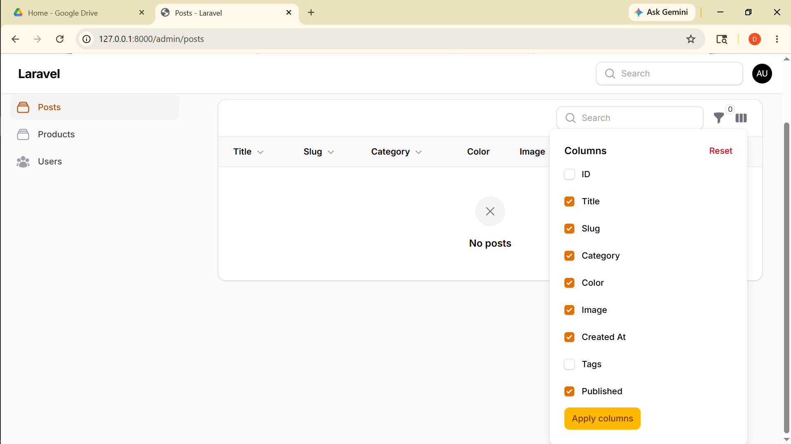

# Laporan Filament

**Nama:** Otavia Ulandari  
**NIM:** 244107020053  
**Kelas:** TI2F  

---

### 1. View Toggle Column pada Table Filament

---

## Analisis & Diskusi

**1. Mengapa toggle column penting pada admin panel?**
Admin panel sering menampilkan banyak kolom sekaligus sehingga tabel menjadi penuh dan tidak nyaman dibaca. Dengan toggle column, pengguna dapat memilih hanya kolom yang relevan untuk ditampilkan sesuai kebutuhannya.

**2. Apa perbedaan `toggleable()` biasa dengan `isToggledHiddenByDefault`?**
`toggleable()` membuat kolom bisa disembunyikan/ditampilkan oleh pengguna, namun kolom tetap tampil saat pertama kali halaman dibuka. Sedangkan `toggleable(isToggledHiddenByDefault: true)` membuat kolom langsung tersembunyi sejak awal, dan pengguna harus mengaktifkannya secara manual jika diperlukan.

**3. Mengapa preferensi kolom tetap tersimpan?**
Filament menyimpan preferensi toggle column ke dalam session browser secara otomatis, sehingga konfigurasi kolom yang dipilih pengguna tidak hilang meskipun berpindah halaman lalu kembali lagi.

**4. Kapan sebaiknya kolom disembunyikan secara default?**
Kolom sebaiknya disembunyikan secara default jika datanya jarang dibutuhkan dalam aktivitas sehari-hari, seperti kolom ID, tags, atau data teknis yang hanya diperlukan dalam kondisi tertentu.