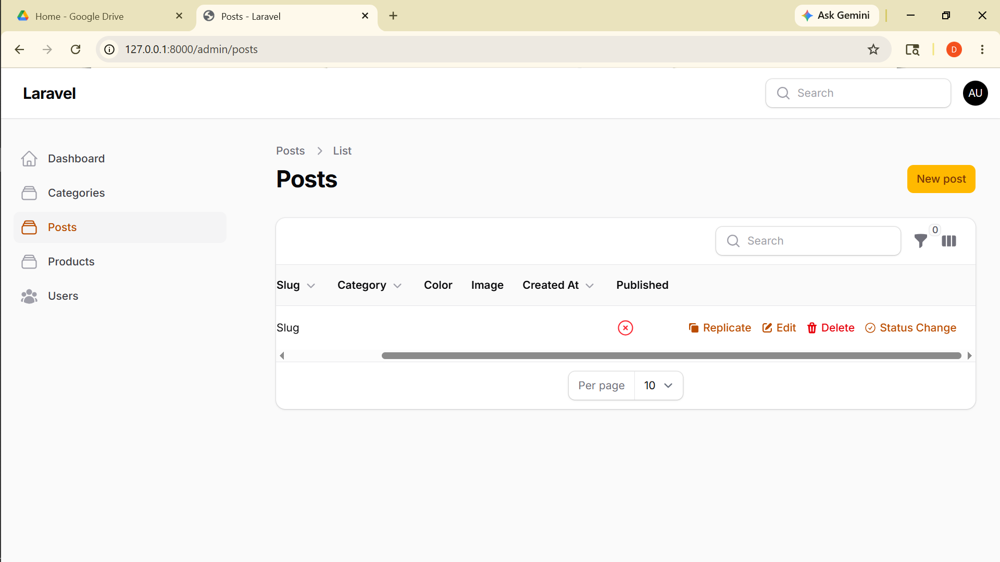

# Laporan Filament

**Nama:** Otavia Ulandari  
**NIM:** 244107020053  
**Kelas:** TI2F  

---

### 1. View Actions & Custom Action di Filament

---

## Analisis & Diskusi

**1. Mengapa action di tabel lebih efisien dibanding halaman edit?**
Action di tabel memungkinkan pengguna melakukan operasi seperti delete atau update status langsung tanpa berpindah halaman, sehingga menghemat waktu dan klik. Alur kerja menjadi lebih cepat karena pengguna tetap berada di halaman list setelah melakukan aksi.

**2. Apa perbedaan predefined action dan custom action?**
Predefined action adalah action bawaan Filament seperti `EditAction` dan `DeleteAction` yang sudah memiliki logika dan tampilan secara otomatis. Sedangkan custom action dibuat menggunakan `Action::make()` yang memberikan kebebasan penuh untuk menentukan form input, logika, dan tampilan sesuai kebutuhan spesifik.

**3. Bagaimana cara menambahkan validasi dalam custom action?**
Validasi dapat ditambahkan pada komponen form di dalam `->schema()` menggunakan method seperti `->required()` atau `->rules()` dari Filament Forms. Filament akan otomatis menghentikan eksekusi `->action()` dan menampilkan pesan error jika validasi tidak terpenuhi.

**4. Kapan kita menggunakan Replicate?**
Replicate digunakan ketika ingin menduplikasi record yang memiliki banyak field sehingga tidak perlu mengisi ulang data dari awal untuk entri yang hampir sama. Fitur ini sangat berguna misalnya saat membuat post baru yang strukturnya mirip dengan post yang sudah ada.